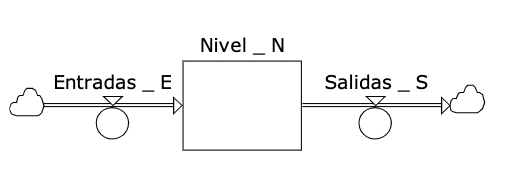
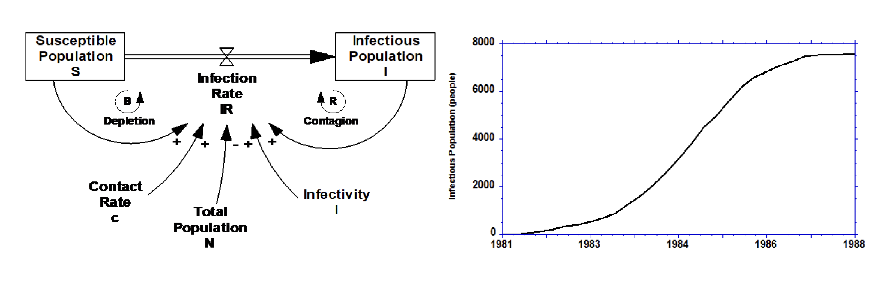

<!-- EL ENCABEZADO SON PROPIEDADES DEL DOCUMENTO EN CSS -->
<!-- Para ver el documento cmd+ SHIFT+ V -->

<style>
h1 {
    color: pink;
    /* font-weight:700;
    font-size: 35px; */
}
h3 {
    color: pink;
    /* font-weight:700;
    font-size: 30px; */
}
h2 {
    color: pink;
    /* font-weight:700;
    font-size: 30px; */
}

img[alt=mediano] { width: 415px; }
img[alt=grande] { width: 500px; }
img[alt=peque] { width: 300px; 
                 float:right  }

img[alt=simbol] { width: 200px; 
                 float:right  }
</style>

<h1>Modelación y Simulación 3 </h1>

# Contenidos

<span style="color:black"></span>

1. [Teoria General de los Sistemas](#teoria-general-de-los-sistemas)
2. [Diagramas Causales](#diagramas-causales)
3. [Arquetipos](#arquetipos)
4. [Estructura y Comportamiento](#estructura-y-comportamiento)
5. [Diagramas de Niveles y Flujos](#diagramas-de-niveles-y-flujos)
6. [Integracion Grafica](#integracion-grafica)
7. [Retardos](#retardos)
8. [Dinamica de Crecimiento en S](#dinamica-de-crecimiento-en-s)
9. [Validacion](#validacion)

# Teoria General de los Sistemas

[Contenidos](#contenidos)

<h3> Definición </h3>

Conjunto de principios o grupo que interactúa o es independiente formando el todo. cada sistema tiene sus límites espaciales o temporales, rodeado e influenciado por su entorno.
Hay patrones de comportamiento que se repiten.

**Entrada:** Materia, energía $\rightarrow$ **Salidas** Interacción entre componentes: Materia, energía, transformación

### Metas principales:

Hay una tendencia general hacia la integración en varias
ciencias naturales y sociales.

Tal integración parece girar en torno a una TGS.

Tal teoría pudiera ser un recurso importante para buscar
una teoría exacta en los campos no físicos de la ciencia.

La teoría y sus principios unificadores nos acerca a la meta
de unidad de la ciencia.

### Realimentación

<br>


### Clasificación de los Sistemas

1. #### Según el medio ambiente:

- Abiertos
- Cerrados
- Ambos

2. #### Según su Naturaleza:

- Concretos
- Abstractos

3. #### Según su origen:

- Naturales
- Artificiales
- Ambos

4. #### Según sus relaciones:

- Simples
- Complejos

5. #### Según su cambio en el tiempo:

- Estáticos
- Dinámicos

6. #### Según tipo de variables:

- Discretos
- Continuos

<br>

# Diagramas Causales

[Contenidos](#contenidos)

Son una forma rápida de **explicar hipótesis** acerca de las causas de la dinámica del sistema
Permiten observar:

- Causalidad
- Relaciones entre variables
- Realimentación
- Captura ESTRUCTURA, no comportamientos.

---


<br>

## ¿Cómo hacer diagramas causales?

<br>

1. Causa vs Correlación

   - La correlación expresa el comportamiento pasado de la variables
   - Incluyen relaciones que captura la estructura interna del sistema( diagramas...)
   - Las correlaciones surgen de la simulación del sistema

2. Definir la polaridad del **vínculo** de variables

   - Positivas +
   - Negativas -

3. Determinar la polaridad del **ciclo**
   Rastrear el efecto de las variables y sus polaridades a medida que se propaga el ciclo
   Multiplicar los signos y lo que se obtiene es la retroalimentación del ciclo.

   - Positivas + $\rightarrow$ Balance
   - Negativas - $\rightarrow$ Refuerzo

4. Dar nombres a los ciclos

<br>


<br>

5. Indicar los retardos importantes
   Crean dinámica

6. Nombres de las variables:

   Nombres $\rightarrow$ Sustantivos, sujetos

   Acciones $\rightarrow$ son las Flechas

   **Escoger nombres positivos**

7. Metas específicas

8. No incluir todos los ciclos en un diagrama grande. Tener cuidado con el detalle del diagrama que sea lo necesario

9. **Todos los ciclos negativos tienen meta**

Los ciclos negativos comparan el estado actual con la meta,
y tratan de corregir la discrepancia
<br>


# Arquetipos

[Contenidos](#contenidos)

Modelo Original (Base de algo)

Patrones de comportamiento que se repiten constantemente en un sistema

### TIPOS DE ARQUETIPOS

1. ### Desplazamiento de Cargas

Problema que se evidencia con síntoma y tiene dos posibles soluciones.

- Olvido del problema

- **Solución rápida:** Solución corto plazo pero persiste el Problema.

- **Solución lenta:** Solución a largo plazo y soluciona el problema.

**Partes:**

- Síntoma
- Solución corto plazo
- Solución largo plazo
- Efecto secundario

**Ejemplos:**

- Arquetipo de los subsidios

- Dolor de Muelas


<br>
<br>

2. ### Soluciones que Fallan

- Impacto Positivo a corto plazo

- Consecuencias imprevistas a largo plazo

- Puede llevarnos a una situación peor de la Original

- Se atacan las consecuencias del problema, no el problema real

**Partes:**

- Estado actual
- Estado deseado
- Diferencia
- Ajuste
- Efecto no deseado

**Ejemplos:**

-Problema de vías


<br>

3. ### Límites al crecimiento

- Se alimenta de sí mismo para crecer

- Hay recurso limitante

- **Partes:**

  - Crecimiento
  - Limitante exogeno
  - Condición
  - Desacelerador

**Ejemplo:**

Siempre tengo 2 baños y varían las personas que los necesitan


<br>
<br>

4. ### Balance con Retardo

Cuando alguno o varias de los procesos dentro del diagrama se demora más que otros.

**Ejemplos:**

Ley Oferta - Demanda


<br>
<br>

5. ### Escalamiento

2 Entidades que se sienten amenazadas por las demás

- Estructura:
  2 Ciclos de Balance que genera un ciclo reforzado

**Partes**

- Resultados de A
- Resultados de B
- Resultados de A/B
- Acción A
- Acción B

**Ejemplo:** CocaCola vs Pepsi, Guerras de precios, inversión en mercadeo


<br>

6. ### Erosión de Metas

Se tiene una meta y un objetivo.

Cuando en vez de incremetar las condiciones para alcanzar el objetivo se disminuye la meta

**Parte:**

- Condicion desada
- Condicion actual
- Brecha $\rightarrow$ diferencia entre c. deseada y c. actual
- Meta
- Presión

**Ejemplos:**

- Pérdida de peso

<br>


<br>

7. ### Éxito para los exitoso

Personas con éxito inicial tendrán exito más adelante

Éxito inicial $\rightarrow$ + apoyo inicial
Víctima $\rightarrow$ repite lo que tuvo éxito en el pasado

- Soluciones:
  - Cambiar objetivo
  - Transformar estructura competitiva en colaborativa
  - Balance con logros

**Partes:**

- Éxito de A
- Éxito de B
- Porcentaje de Recursos A/B
- Recursos para A
- Recursos para B

**Ejemplos:**
Equipos de fútbol ganadores, universidades, canales de TV, directores de cine
<br>


<br>

8. ### Tragedia de los comunes

Se comparte un recurso limitado entre varios individuos. Este tenderá a acabarse.

Se deben establecer límites

**Partes:**

- Ganancia A
- Ganancia B
- Actividad A
- Actividad B
- Actividad total
- Ganancia individual
- Limite del recurso

**Ejemplo**

Estanque de peces, el que pesque más hasta que se muera la población

<br>


# Estructura y Comportamiento

[Contenidos](#contenidos)

## Básicos

---


### 1. Crecimiento Exponencial

<br>

**Realimentación positiva**

El estado del sistema se duplica en un período fijo de tiempo

<br>

<br>

---


### 2. Búsqueda de Metas

<br>

**Realimentación Negativa**

Los ciclos negativos buscan balancear o equilibrar los sistemas.

Tratan de llevar el sistema a un estado deseado

<br>
**Ejemplos:** Inventarios, Agua caliente en la ducha, etc

---


### 3. Oscilaciones

<br>

**Realimentación Negativa con retardos**

El estado del sistema constantemente varía alrededor de la meta o equilibrio.

---

<br>
<br>

## Interacciones no lineales de los modos Básicos

<br>

---


### 4.Crecimiento en forma de S

**Crecimiento exponencial al principio**

**Refuerzo y Balance**

El crecimiento disminuye gradualmente hasta que el sistema alcanza un
nivel de equilibrio

| CONDICIONES CRITICAS                                                                                                             |
| -------------------------------------------------------------------------------------------------------------------------------- |
| Sin retardos de tiempo significativos. Si los tuviera, el sistema alcanzaría la capacidad de carga y oscilaría alrededor de ella |
| La capacidad de carga debería ser fija                                                                                           |

**Ejemplo:**

CAPACIDAD DE CARGA

---


### 5.Crecimiento con Overshoot y Oscilación

**Refuerzo , Balance y RETARDO**

| CONDICIONES CRITICAS            |
| ------------------------------- |
| Retardo de tiempo significativo |

---


### 6.Overshoot y Colapso

**Refuerzo , Balance con o sin retardo , capacidad de carga**

| CONDICIONES CRITICAS       |
| -------------------------- |
| Capacidad de Carga NO FIJA |

---

# Diagramas de Niveles y Flujos

[Contenidos](#contenidos)

Permiten:

- Entender el concepto de **acumulación** y **tasa de cambio** (flujos)
- Modelar los cambios de los sistemas matemáticamente
- Simular el comportamiento de sistemas
- Son representaciones de sistemas de ecuaciones diferenciales acopladas

| DIAGRAMAS DE NIVELES Y FLUJOS |  
| VARIABLE | USOS | SÍMBOLO |
| ----------- | ----------- | ----------- |
| NIVELES | Acumulador , Unidades sin tiempo, Variables de estado |  |
| FLUJOS | Única forma de cambiar **niveles** , Regula entrada y salida de niveles , Siempre unidades/tiempo |  |
| FUENTES / SUMIDEROS | No hay límites de recursos |   |
| VARIABLES AUXILIARES | Cálculos auxiliares, Convertidores de información |  |
| PARÁMETROS | Valores constantes durante toda la simulación, Constantes Universales | 
| CONECTORES | Muestran flujos de información |  |

### Relación entre niveles y flujos

Tasa Neta = $T_{neta}= Entrada - Salida$

$\frac{dN}{dt} =  \sum_{i=1}^n Entrada - Salida = \sum T_{neta}$

$\frac{[ Personas ]}{[ año ]} = \frac{ Personas }{ año }$

### Pasos para hacer SIMULACIÓN EN VENSIM de diagramas de Niveles y de flujos

1. Hacer diagramas de flujos y niveles
2. AGREGAR CONDICIONES INICIALES y **unidades** (No hay que escribir la ec. diferencial de los niveles si está bien hecho el diagrama )
3. Agregar Valores de parámetros y unidades
4. Agregar ec.auxiliares y VERIFICAR Unidades
5. Agregar ecuación de flujos y VERIFICAR Unidades
6. Simular y ver resultados

# Integracion Grafica

[Contenidos](#contenidos)

Matemáticamente...
Los niveles integran sus flujos negativos
El flujo Neto es la derivada de un nivel

Tasa Neta = $T_{neta}= Entrada - Salida$

$\frac{dN}{dt} =  \sum_{i=1}^n Entrada - Salida = \sum T_{neta}$

$N(t) = N(0) +  \int_{T_{0}}^{T}  Entrada- Salida \, dt$

$Tasa Neta = \sum Flujos de entrada - \sum Flujos de salida$

$\frac{[ Personas ]}{[ año ]} = \frac{ Personas }{ año }$



### Equilibrio estático y dinámico

#### Un sistema está en equilibrio si todos sus niveles permanecen sin cambio

- **Equilibrio:**
  La tasa neta de cambio del nivel es cero

$\sum Entrada - \sum Salida $

- **Equilibrio dinámico:**
  Los flujos de entrada igualan a los flujos de salida

$\sum Entrada = \sum Salida $

**Equilibrio estático:**
Todos los flujos desde y hacia el nivel son cero

$ Entrada=0 Salida=0 $

### Integración Gráfica:

A partir del comportamiento de los **flujos**, inferir el comportamiento de los **niveles**


### Diferenciación Gráfica:

A partir del comportamiento de los **niveles**, inferir el comportamiento de la tasa neta de **flujo**

Simplemente hay que estimar la pendiente del nivel en cualquier punto del tiempo

Solo puede hallarse la tasa de cambio neta.

Si existen múltiples flujos de entrada y salida no es posible determinar su valor individual.


# Retardos

[Contenidos](#contenidos)

Proceso cuyos resultados quedan atrás de sus causas en alguna forma

**_Los retardos siempre crean peligros_**

**Peligrosos:** Inestabilidad y oscilación

**Benéficos:** Filtran variabilidad indeseada, separan señales y ruidos.

## Características:

- Toma tiempo

- Afectan el estado del sistema

#### Ejemplos:

▪ Moda
▪ Difusión de tecnologías
▪ Epidemia
▪ Llegada del circo
▪ Construcción de una represa
▪ Crecimiento de un cultivo

## Tipos de Retardos:

## Hay que preguntarse:

**Tiempo promedio del retardos**

**Distribución del retardo**

### A.Por Tipo:

### 1. Retardo Material

Existen unidades físicas moviéndose a través del proceso

Las entrada y salida en los retardos de material se conservan


### Retardo de Material de 1er Orden

La salida es proporcional al nivel de material en tránsito

`Salida = Nivel/Tiempo de Retardo`


### Retardo de Material de 3er Orden

```
Retardo = Tiempo de Retardo / 3
Tasa 2 = Nivel 1 / Retardo
Tasa 3 = Nivel 2 / Retardo
Salida = Nivel 3 / Retardo
```


### Retardo de Material de Orden Infinito

▪ Retardo discreto
▪ Retardo de Tubería

**_Banda transportadora_**

### 2. Retardo de Información

Las creencias, expectativas y proyecciones están basadas en la información disponible hasta el momento

Las personas no cambian su forma de pensar inmediatamente frente al arribo de nueva información

Las percepciones o las creencias no se conservan

La única información es el comportamiento actual y pasado del sistema.

Toma tiempo juntar la información y decidir la nueva tendencia $\rightarrow$ Los cambios en el pronóstico serán retardados detrás de las condiciones actuales.

El pronóstico se ajusta (adapta) gradualmente a la serie de datos reales. Si el pronóstico es persistentemente equivocado, se ajustará gradualmente hasta que el error es eliminado.

### Retardo de Información de 1er Orden


`Cambio en la entrada = (Entrada - Salida) / Retardo de Tiempo`

### Retardo de Información de 3er Orden


### B.Según el orden:


### Retardo de Tubería

El tiempo total de retardo es constante.

El orden de salida de los items es exactamente igual al orden de entrada.

“Intervalo de Transporte

## Modelando Retardos

Información:

```
SMOOTH(<Input>,<DelayTime>)... también SMOOTH3
SMOOTHI(<Input>,<DelayTime>,<Initial>)... también SMOOTH3I
```

Material:

```
DELAY1(<Input>,<DelayTime>) ...también DELAY3
Salida = DELAY3I(Entrada,Tiempo_Retardo,”Inicial”)
DELAY1I (<Input>,<DelayTime>, <Initial>)... también DELAY3I

```

Tubería:

```
DELAY FIXED(<Input>,<DelayTime>,<Initial>)
```

# Dinamica de Crecimiento en S

[Contenidos](#contenidos)

### Modelo de Epidemias



# Funciones No lineales

[Contenidos](#contenidos)

## Relaciones no lineales

## Funciones Tabla

Son una herramienta

**Analiza que tanto cambia el modelo si yo cambio algún parámetro.**

1. Normalización
2. Puntos de referencia
3. Políticas de referencia
4. Valores extremos
5. Dominio de la variable independiente
6. Formas posibles
7. Especificar Valores
8. Verificar comportamiento del modelo


# Validacion de Modelos

[Contenidos](#contenidos)

- Modelos formales o mentales
- ¿Es el modelo una **representación** adecuada de la **realidad** respecto a su **propósito** ?
- Importan supuestos
- Buena documentación para creerla
- Comprensión

### Es más que replicar el comportamiento

- Cada variable debe tener una explicación real:
  Entender de donde vienen las variables, qué significan, que significan las relaciones, retardos, etc.

## Tipos de Modelos

## 1. Modelos caja negra o CORRELACIONALES:

    No se conocen como funciona, ni su estructura, sin embargo, son muy perfectos

## 2. Modelos caja blanca o CAUSALES:

    Se conoce cómo funcionan, su estructura, relaciones, etc.

### “Resultado correcto por las razones correctas”

### Pruebas de límites del Modelo

1. 
2. 
3. 

### Pruebas de evaluación de la estructura

- Verificar la consistencia de la estructura con el sistema real
- Agregación, sistema físico.

### Consistencia dimensional